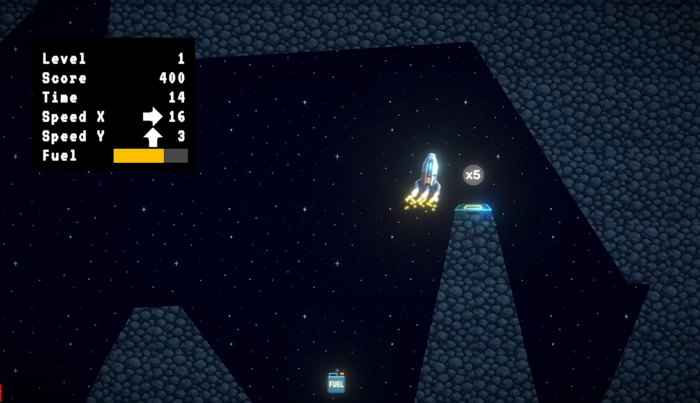

# LuaLander 2D: Physics-Driven Lunar Landing Simulator

A physics-based 2D lunar landing simulation game built using **Unity Engine (Universal 2D / URP)** and **C#**. Designed with professional software engineering patterns, the project prioritizes strict decoupling of game logic from visual rendering, event-driven observer architectures, deterministic 2D vector kinematics, and mathematical landing evaluations.

<p align="center">
  
</p>
---

### 🎮 Play & Download
* **Playable Windows Build (.zip):** [Download from Google Drive](linkHere)


---

### System Architecture & Logic-Visual Decoupling

The architecture enforces strict separation between physical state calculation (`FixedUpdate`), audio/particle presentation, and UI presentation through C# events and delegates:

```text
                                +-----------------------------+
                                |      GameInput Wrapper      |
                                | (Keyboard, Gamepad, Touch)  |
                                +--------------+--------------+
                                               |
                                               v
                                +-----------------------------+
                                |       Lander Core Logic     |
                                | - Rigidbody2D Forces        |
                                | - Fuel Consumption State    |
                                | - Collision & Landing Math  |
                                +--------------+--------------+
                                               |
                        +----------------------+----------------------+
                        | (Invokes Event)                             | (Invokes Event)
                        v                                             v
        +-------------------------------+             +-------------------------------+
        |        LanderVisuals          |             |          LanderAudio          |
        | - Particle System Emissions   |             | - AudioSource State Machine   |
        | - Explosion Instantiation     |             | - Pitch & Volume Modulators   |
        +-------------------------------+             +-------------------------------+
                        |                                             |
                        +----------------------+----------------------+
                                               |
                                               v
                                +-----------------------------+
                                |   GameManager / UI Views    |
                                | - Stats HUD (Speed/Fuel)    |
                                | - Landing Summary Dialogs   |
                                | - Cinemachine Camera Zoom   |
                                +-----------------------------+
